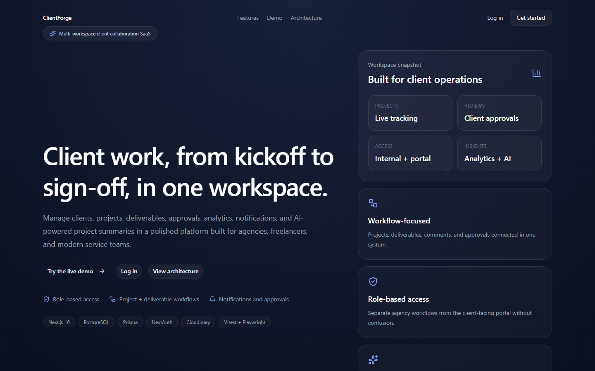
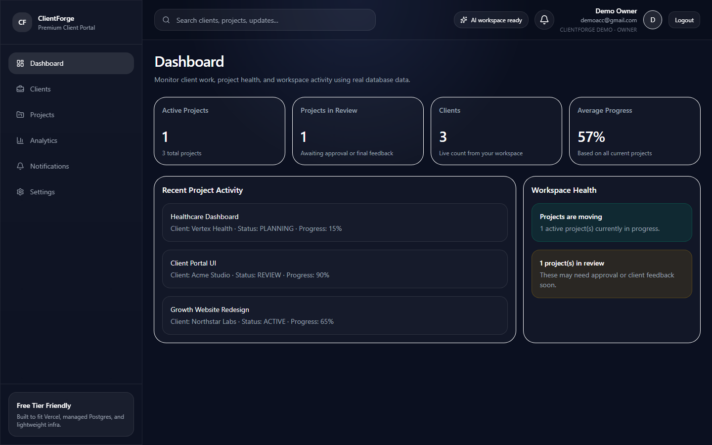
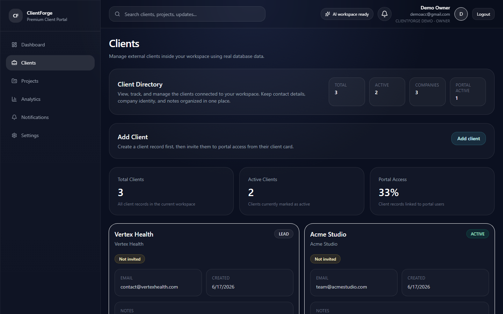
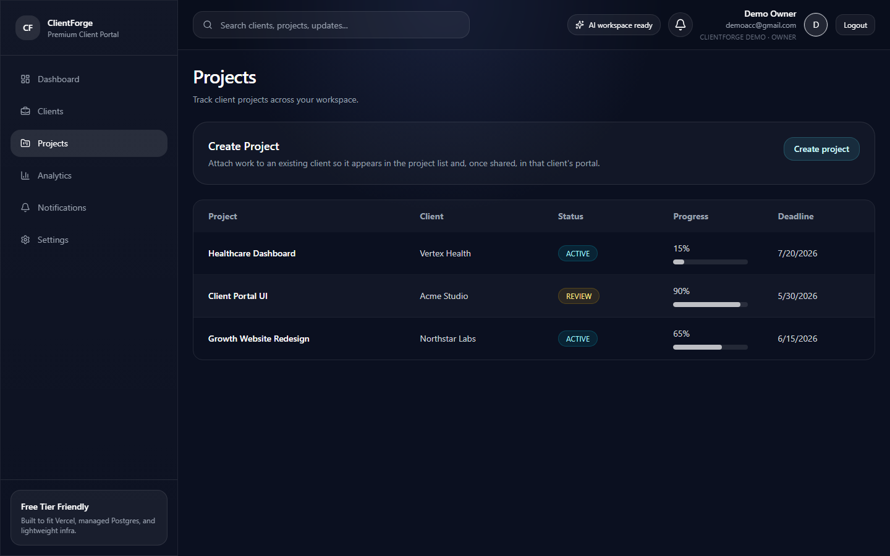
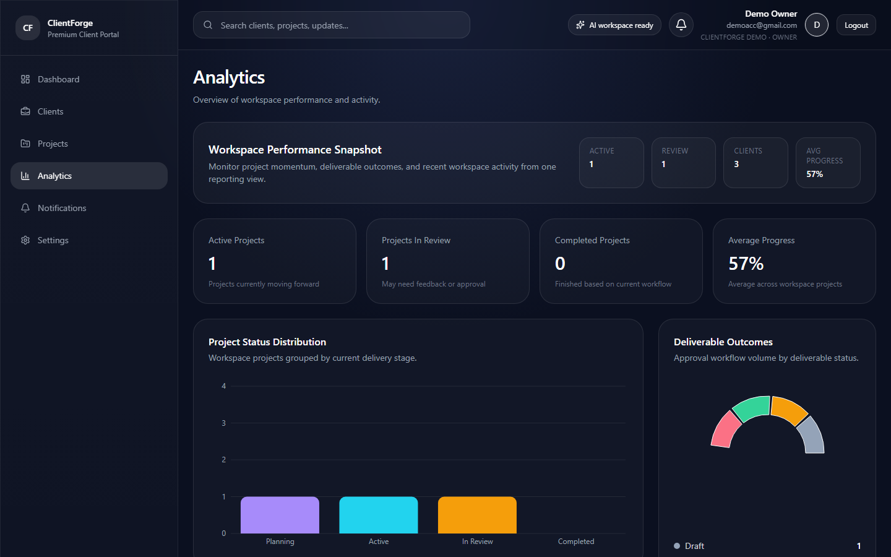
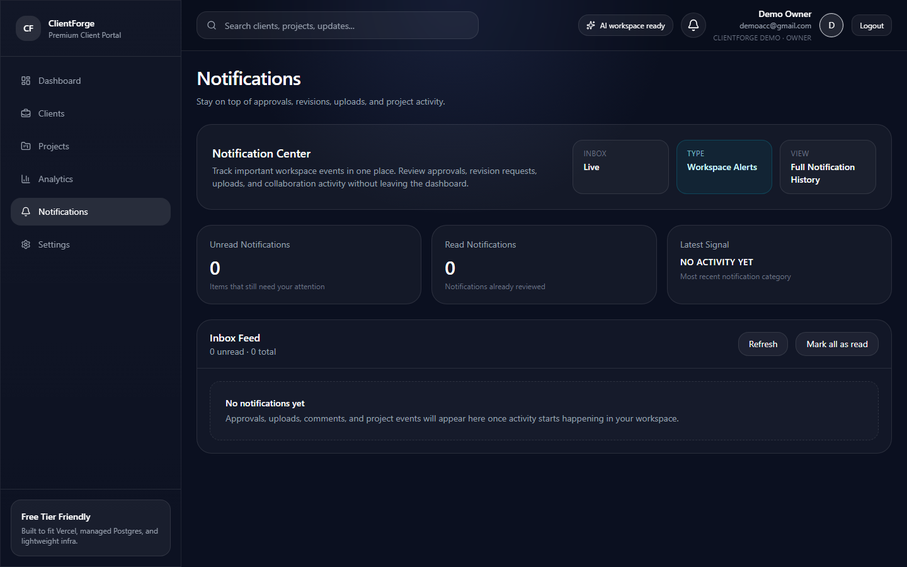
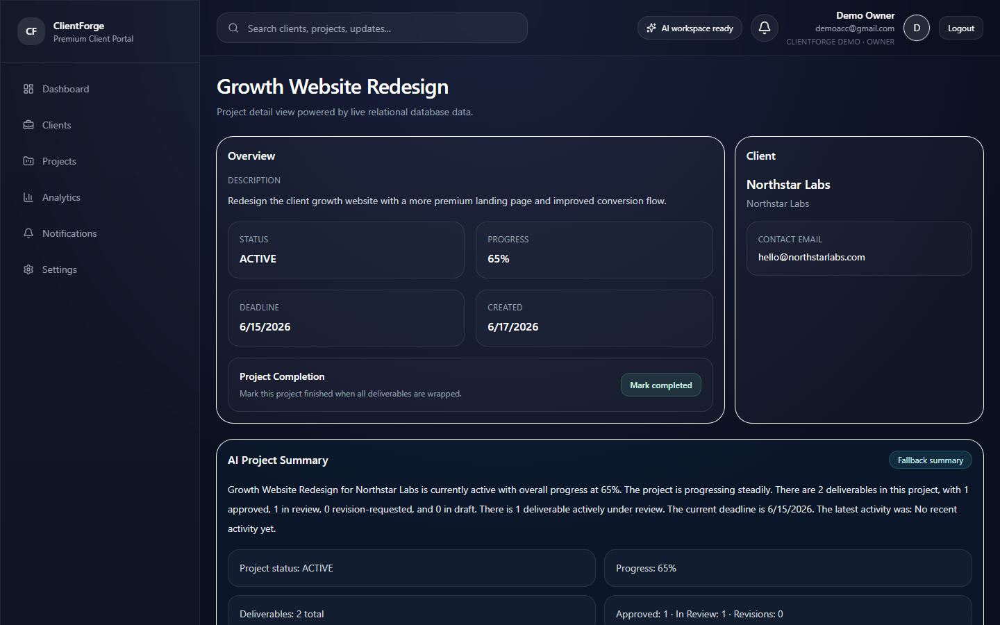
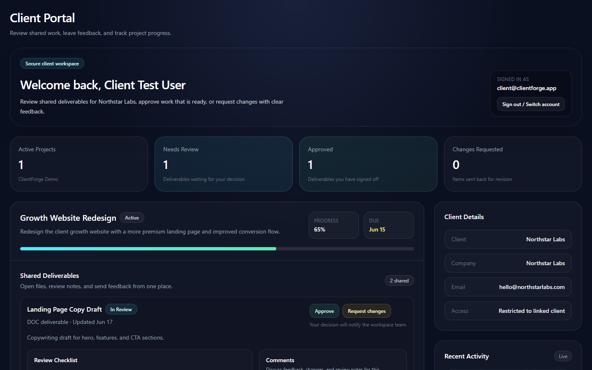

# ClientForge

**Live demo:** [https://clientforge-nu.vercel.app](https://clientforge-nu.vercel.app)

ClientForge is a client portal SaaS for freelancers, agencies, and service teams. It brings client records, project tracking, deliverables, approvals, comments, notifications, analytics, and a scoped client portal into one workspace.

Under the hood it includes multi-tenant authorization, Cloudinary file storage, input validation, rate limiting, route boundaries, seeded demo data, unit tests, and an end-to-end owner/client workflow.

## Screenshots

| Landing | Owner dashboard |
| --- | --- |
|  |  |

| Clients | Projects |
| --- | --- |
|  |  |

| Analytics | Notifications |
| --- | --- |
|  |  |

| Project detail | Client portal |
| --- | --- |
|  |  |

Use the live demo buttons on the landing page to explore as **Owner** or **Client** without creating an account.

## Demo Accounts

Seeded credentials for local development and the public demo:

```txt
Owner
Email: demoacc@gmail.com
Password: password123

Client
Email: client@clientforge.app
Password: client123
```

The client account is linked to the `Northstar Labs` client record, so `/portal` only exposes that client's projects and deliverables.

## Product Highlights

- Workspace-scoped clients, projects, deliverables, comments, activity logs, and notifications.
- Internal dashboard for owners/admins/members.
- Client portal with linked-client isolation via `Client.userId`.
- Deliverable workflow: draft, in review, approved, revision requested.
- Cloudinary-backed deliverable file uploads with authorized download proxy.
- Analytics charts for project status, deliverable outcomes, and activity trends.
- OpenAI project summaries with deterministic fallback.
- Production hardening: route guards, object-level authorization, zod validation, rate limiting, error/loading/not-found boundaries.
- Tests: Vitest permission unit tests and Playwright owner/client approval flow.

## Tech Stack

- Next.js 16 App Router
- React 19
- TypeScript
- Tailwind CSS v4
- Prisma + PostgreSQL (Neon)
- NextAuth credentials auth
- Cloudinary uploads
- Upstash-compatible rate limiting
- Zod validation
- Recharts
- Vitest + Playwright

## Architecture

```txt
Browser
  -> Next.js App Router pages and route handlers
  -> NextAuth credentials session
  -> Guard helpers: requireInternalAccess / requireClientAccess
  -> Object-level authorization in API queries
  -> Prisma Client
  -> PostgreSQL (Neon)

Deliverable uploads
  -> /api/deliverables/[id]/file
  -> Cloudinary
  -> authorized download via /api/deliverables/[id]/file/download
  -> fileUrl/fileName/fileSize/fileType stored on Deliverable

Client portal
  -> User with WorkspaceRole.CLIENT
  -> linked Client.userId
  -> projects filtered by workspaceId + clientId
```

## Local Setup

Install dependencies:

```bash
npm install
```

Create your local environment:

```bash
cp .env.example .env
```

Fill in:

```txt
DATABASE_URL
DIRECT_URL
NEXTAUTH_URL
NEXTAUTH_SECRET
CLOUDINARY_CLOUD_NAME
CLOUDINARY_API_KEY
CLOUDINARY_API_SECRET
```

Optional:

```txt
OPENAI_API_KEY
UPSTASH_REDIS_REST_URL
UPSTASH_REDIS_REST_TOKEN
NEXT_PUBLIC_APP_URL
```

If Upstash variables are missing locally, ClientForge uses an in-memory rate-limit fallback.

Prepare the database:

```bash
npx prisma generate
npx prisma migrate deploy
npm run db:seed
```

Start the app:

```bash
npm run dev
```

Open [http://localhost:3000](http://localhost:3000).

Inspect data:

```bash
npx prisma studio
```

## Scripts

```bash
npm run dev          # Start local dev server
npm run build        # Production build
npm run lint         # ESLint
npm test             # Vitest unit tests
npm run test:e2e     # Playwright e2e tests
npm run screenshots  # Refresh README screenshots from the live demo
npm run db:seed      # Seed demo workspace/users/projects
```

## Test Coverage

Current automated coverage:

- `lib/permissions.test.ts`: verifies workspace and client deliverable access rules.
- `e2e/owner-client-deliverable.spec.ts`: owner uploads a deliverable, moves it to review, and the linked client approves it in the portal.

Run all current checks:

```bash
npm test
npx tsc --noEmit
npm run lint
npm run build
npm run test:e2e
```

## Deployment

Production stack: **Vercel + Neon + Cloudinary**.

Required Vercel environment variables:

```txt
DATABASE_URL
DIRECT_URL
NEXTAUTH_URL
NEXTAUTH_SECRET
CLOUDINARY_CLOUD_NAME
CLOUDINARY_API_KEY
CLOUDINARY_API_SECRET
CLOUDINARY_UPLOAD_FOLDER
```

Recommended:

```txt
NEXT_PUBLIC_APP_URL
UPSTASH_REDIS_REST_URL
UPSTASH_REDIS_REST_TOKEN
OPENAI_API_KEY
```

After connecting Neon:

```bash
npx prisma migrate deploy
npm run db:seed
```

In Cloudinary, enable **Allow delivery of PDF and ZIP files** under Settings → Security.

## Security And Correctness Notes

- Client portal data is scoped through `Client.userId`.
- API mutations verify workspace ownership before touching project or deliverable records.
- Zod validates core mutation inputs.
- Cloudinary replaces local filesystem uploads for Vercel-safe storage.
- AI summaries use OpenAI when configured and fall back to deterministic summaries if unavailable.
- Rate limiting protects signup, uploads, comments, deliverable creation/status, and client review actions.

## Roadmap

See `architecture_plan.md` for the full working roadmap. Remaining polish items:

- Privacy/terms placeholder pages
- Favicon and Lighthouse tuning
- Optional public demo reset action
- Optional command palette
